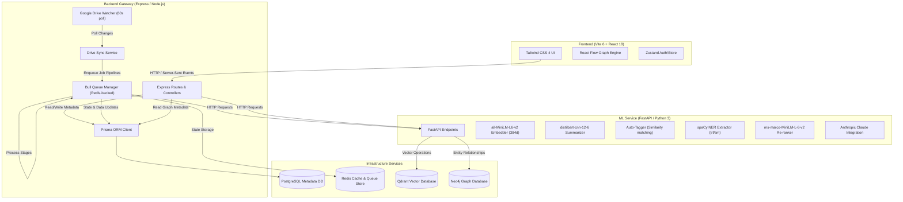
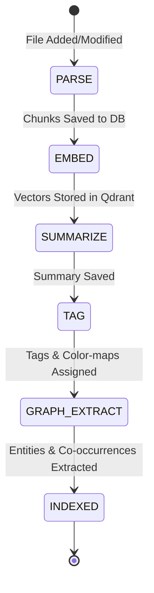

# 🌌 KnowledgeOS

An AI-powered, personal knowledge management and retrieval system that turns your raw files (PDFs, Markdown, text, and media) into a structured, searchable semantic knowledge base. Features include Google Drive background sync, vector-based hybrid search, an interactive knowledge graph, spaced repetition learning card decks, automated summarization & tagging, and a RAG-powered chatbot with real-time streaming citations.

---

## 🏗️ Architecture Overview

KnowledgeOS uses a split-service model, featuring a modern **TypeScript backend gateway** orchestrating background queues, a **FastAPI ML inference engine** handling vector and NLP tasks, and a reactive **React/Vite frontend** visualizing multi-dimensional document relationships.



---

## 🗂️ Monorepo Structure

KnowledgeOS is managed as an `npm` workspaces monorepo. Here is a breakdown of the key directories:

```
├── apps/
│   ├── backend/          # Express API, Bull queue handlers, Drive watcher, Prisma schema
│   ├── frontend/         # Vite 6 + React 18 web app, React Flow graph visualization
│   └── ml-service/       # FastAPI ML server, transformer pipeline wrappers, Qdrant client
├── packages/
│   └── shared-types/     # Shared TypeScript interfaces, types, and enums
├── infra/
│   ├── docker/           # Dockerfiles (Backend, Frontend, ML Service) and Nginx config
│   └── docker-compose.yml# Multi-container local deployment (DBs, Redis, vector, and graph stack)
├── package.json          # Root workspace configuration & scripts
└── .env.example          # Template for application environment settings
```

---

## ⚡ Key Modules & Pipelines

### 🔄 The Document Processing Pipeline
When a new or updated file is detected in Google Drive, KnowledgeOS enqueues a sequential background job pipeline managed via **Bull** and backed by **Redis**:



1. **`PARSE` Stage**: Downloads the file from Google Drive using Google APIs. Text is extracted based on its MIME type (using `pdf-parse` for PDFs, native readers for text/markdown). The parsed text is split into chunks of maximum $512$ tokens with a $50$-token overlap, maintaining sentence boundaries. Heading and page number contexts are extracted and stored.
2. **`EMBED` Stage**: Chunks are sent to the ML service to generate $384$-dimensional dense vector embeddings using `all-MiniLM-L6-v2`. Vectors are upserted into **Qdrant**, and the resulting `qdrantPointId` is stored in PostgreSQL.
3. **`SUMMARIZE` Stage**: A hierarchical summarization is performed using `distilbart-cnn-12-6`. If text is longer than $1024$ tokens, chunks are summarized individually, and the summaries are combined and condensed down to $50\text{–}150$ tokens.
4. **`TAG` Stage**: The document title and generated summary are embedded together and compared via cosine similarity against pre-computed embeddings of $22$ predefined topic categories (e.g., Computer Science, Law, Philosophy, Medicine). Tags with confidence $> 0.35$ are upserted and assigned.
5. **`GRAPH_EXTRACT` Stage**: The document text is processed by **spaCy**'s NER pipeline combined with pattern-matching rules for tech terms. Entities (Person, Place, Technology, Concept) are extracted. Co-occurrences within sentences are calculated to establish document-concept relationships. The document status is updated to `INDEXED`.

---

### 🔍 Semantic Search & Cross-Encoder Re-ranking
1. The user inputs a query.
2. The ML Service embeds the query via the `all-MiniLM-L6-v2` encoder.
3. A vector similarity search is performed in **Qdrant** filtered by the authenticated user's ID.
4. The top $3\times K$ results (up to $50$) are fetched.
5. A cross-encoder (`ms-marco-MiniLM-L-6-v2`) evaluates query-chunk pairs, producing a fine-grained relevance score.
6. The combined score ( $70\%$ Cross-Encoder + $30\%$ Vector Similarity ) is sorted, and the top $K$ results are returned and enriched with PostgreSQL document metadata (tags, title, URL).

---

### 💬 RAG-Based Chat & Q&A Stream
- A streaming conversational route using **Server-Sent Events (SSE)**.
- Query chunks are retrieved, formatted as context cards labeled `[Source N]`, and passed to **Anthropic Claude** (`claude-sonnet-4-20250514`) alongside a strict system prompt.
- Answers are streamed back chunk-by-chunk in real-time. A clean citation block showing source titles, pages, and snippets is appended to the stream on completion.
- If no Anthropic API key is provided, the ML Service generates a fallback context summary.

---

### ⏱️ Spaced Repetition (Revision Deck)
- Users can create revision cards for specific topics within a document.
- Next-review schedules are driven by the **SM-2 Algorithm**.
- Review response qualities range from $0$ (Complete Blackout) to $5$ (Perfect Response).
- Intervals are updated using `easeFactor` and `repetitionCount`:
  - Quality $< 3$: Repetition count resets to $0$, interval set to $1$ day.
  - Quality $\ge 3$: First repetition has $1$ day interval; second has $6$ days; subsequent intervals are scaled by `easeFactor` ($\text{EF} \ge 1.3$).

---

## 🗄️ Database Schema (Prisma & PostgreSQL)

The relational engine coordinates system state. Core database models include:

- **`User`**: Google user info, Drive folder IDs, access/refresh OAuth tokens, and synchronization cursors.
- **`Document`**: Metadata, sync status (`PENDING`, `PROCESSING`, `INDEXED`, `FAILED`), hierarchical summaries, and access tracking statistics.
- **`Chunk`**: Extracted document fragments containing heading contexts, page indicators, and Qdrant vector coordinates.
- **`Tag` & `DocumentTag`**: Pre-defined or custom classification tag metrics mapped with prediction confidences.
- **`KnowledgeNode`**: Named entities extracted from documents (People, Places, Tech, Concepts) pointing to coordinate markers.
- **`DocumentRelation`**: Multi-hop relationships between documents (similarities, prerequisite requirements, topic overlaps).
- **`RevisionItem`**: Tracks learning history, intervals, and ease parameters for the spaced repetition index.
- **`ProcessingJob`**: Execution state logs for every background pipeline step.

---

## 🛠️ Setup & Installation Guide

### Prerequisites
- **Node.js**: `v20.0.0` or higher
- **NPM**: `v10.0.0` or higher
- **Docker & Docker Compose**: For local storage infrastructure
- **Python**: `3.10+` (for running ML service locally)
- **Google Cloud Platform Account**: For Drive API client credentials

---

### Step 1: Environment Setup
Clone the repository, go into the root directory, copy the environment template, and fill in the values:

```bash
cp knowledgeos/.env.example knowledgeos/.env
```

Ensure you configure:
- **`GOOGLE_CLIENT_ID`** & **`GOOGLE_CLIENT_SECRET`**: Google Web application client credentials with `Google Drive API` and `Google People API` scopes enabled.
- **`JWT_SECRET`**: A cryptographically secure random string (minimum 32 characters).
- **`ANTHROPIC_API_KEY`**: Optional API key for RAG chat capabilities.

---

### Step 2: Spin Up Infrastructure
Use Docker Compose to launch PostgreSQL, Redis, Qdrant, and Neo4j instances:

```bash
npm run docker:up
```

You can verify container health statuses:
- **PostgreSQL**: `localhost:5432`
- **Redis**: `localhost:6379`
- **Qdrant Console**: `localhost:6333`
- **Neo4j Cypher Console**: `localhost:7474` (Bolt: `localhost:7687`)

---

### Step 3: Initialize Database
Generate the Prisma Client and execute migrations to create PostgreSQL schemas:

```bash
# Generate Prisma types
npm run prisma:generate

# Execute migration scripts
npm run prisma:migrate
```

---

### Step 4: Run Services
You can run all components in development mode side-by-side using workspace commands.

#### A. Running the Backend Gateway
Enables API routes, Google Drive syncing, and enqueues Bull processors:

```bash
# In the root monorepo folder
npm run dev:backend
```

#### B. Running the ML Inference Service
1. Create a Python virtual environment and activate it:
   ```bash
   cd knowledgeos/apps/ml-service
   python -m venv venv
   # On Windows:
   .\venv\Scripts\activate
   # On macOS/Linux:
   source venv/bin/activate
   ```
2. Install Python requirements:
   ```bash
   pip install -r requirements.txt
   ```
3. Boot the FastAPI ML engine:
   ```bash
   python main.py
   ```
   *Note: On initial startup, the service will automatically download `all-MiniLM-L6-v2`, `distilbart-cnn-12-6`, and spaCy's English model.*

#### C. Running the React Frontend
Installs web bundles and runs the Vite dev server locally:

```bash
# In the root monorepo folder
npm run dev:frontend
```
The client dashboard will open on `http://localhost:3000`.

---

## 🔌 API Gateway Routes Reference

### Backend Gateway (`http://localhost:4000`)

| Method | Route | Description | Auth Required |
|:---|:---|:---|:---|
| **GET** | `/auth/google` | Initiates Google OAuth sequence | No |
| **GET** | `/auth/google/callback` | Callback redirect executing JWT generation | No |
| **GET** | `/auth/me` | Fetches active user session metrics | Yes |
| **POST** | `/api/drive/sync-now` | Triggers immediate Google Drive file sync | Yes |
| **GET** | `/api/drive/status` | Retrieves status overview of indexing queue | Yes |
| **GET** | `/api/documents` | Lists all indexed/processing documents | Yes |
| **GET** | `/api/graph/nodes` | Returns node elements formatted for graph renders | Yes |
| **GET** | `/api/graph/edges` | Returns document connection edge coordinates | Yes |
| **POST** | `/api/search` | Performs re-ranked semantic query search | Yes |
| **POST** | `/api/qa` | SSE stream for RAG question answering | Yes |
| **GET** | `/api/recommendations` | Fetches discovery/similarity recommendations | Yes |
| **GET** | `/api/revision/due` | Fetches card items ready for active review | Yes |
| **POST** | `/api/revision/review` | Submits card review parameters (SM-2 updates) | Yes |

### ML Inference Service (`http://localhost:8000`)

| Method | Route | Input Schema | Description |
|:---|:---|:---|:---|
| **POST** | `/ml/embed` | `{ chunks: [{ id, content }], userId, documentId }` | Encodes text arrays into 384d Qdrant vectors |
| **POST** | `/ml/summarize` | `{ text, maxLength, minLength }` | Generates hierarchical DistilBART summaries |
| **POST** | `/ml/tag` | `{ title, summary, userId }` | Runs similarity against predefined taxonomy topics |
| **POST** | `/ml/extract-entities` | `{ text, documentId, userId }` | Runs spaCy NER and builds relationship lists |
| **POST** | `/ml/search` | `{ query, userId, topK, filters }` | Queries Qdrant and applies cross-encoder re-ranking |
| **POST** | `/ml/qa` | `{ question, userId, topK }` | SSE-driven pipeline streaming Claude responses |
