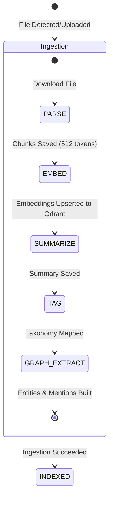

# KnowledgeOS Technical Architecture & Feature Guide

KnowledgeOS is an AI-powered personal knowledge management (PKM) and retrieval system designed to ingest, process, catalog, search, and quiz users on unstructured data (PDFs, Markdown, text, and media). 

---

## 🏗️ Architectural Overview & Tech Stack

KnowledgeOS is designed as a split-service monorepo:

```
               ┌──────────────────────────────┐
               │    React/Vite 6 Frontend     │
               └──────────────┬───────────────┘
                              │ HTTP / SSE (Event Stream)
                              ▼
               ┌──────────────────────────────┐
               │    Express API Gateway       │
               └──────────────┬───────────────┘
                              │
             ┌────────────────┴────────────────┐
             ▼                                 ▼
┌─────────────────────────┐       ┌─────────────────────────┐
│     PostgreSQL          │       │  Bull Queue / Redis     │
│   (Prisma Metadata)     │       │    (Job Processing)     │
└─────────────────────────┘       └────────────┬────────────┘
                                               │
                                               ▼
                                  ┌─────────────────────────┐
                                  │   FastAPI ML Service    │
                                  └────────────┬────────────┘
                                               │
                                ┌──────────────┴──────────────┐
                                ▼                             ▼
                  ┌─────────────────────────┐   ┌─────────────────────────┐
                  │    Qdrant Vector DB     │   │   Gemini LLM (RAG)      │
                  │   (Embeddings Index)    │   │      (Inference)        │
                  └─────────────────────────┘   └─────────────────────────┘
```

### Core Technologies
1. **Frontend (Vite 6 + React 18):** Styled with Tailwind CSS 4, utilizing Zustand for local state management (authentication, file upload queues) and React Query (TanStack) for API caching.
2. **Backend API Gateway (Express.js / Node.js):** Orchestrates sync controllers, handles token refreshes, manages direct file uploads, and proxies RAG streams.
3. **ML Service (FastAPI / Python 3):** Encapsulates deep learning models, embeddings extraction, auto-tagging, entity recognition (spaCy), and RAG LLM orchestration.
4. **Queue Store (Bull / Redis):** Backs the document processing pipeline using asynchronous, multi-stage background job queues.
5. **Storage Infrastructure:**
   - **PostgreSQL (Prisma ORM):** Manages user authentication, documents index, parsing audits, tags taxonomy, and spaced repetition decks.
   - **Qdrant:** High-performance vector database storing 384-dimensional document chunk embeddings.
   - **Google Drive API:** Serves as the primary remote file host where all user knowledge files are stored.

---

## ⚙️ Core Features & Implementation Details

### 1. Document Ingestion & Processing Pipeline
Ingestion happens via two pathways: Google Drive automated sync or client direct upload.



#### Detailed Pipeline Stages:
1. **`PARSE` Stage:** Downloads binary content. Runs mime-type specific parsers (e.g. `pdf-parse` for PDFs, text buffers for markdown). splits extracted text into overlapping chunks of maximum 512 tokens (50 tokens overlap) while maintaining sentence boundaries. Results are written to the `Chunk` table in PostgreSQL.
2. **`EMBED` Stage:** Chunks are sent to the FastAPI ML service. Encoded into 384-dimensional dense vectors using the `all-MiniLM-L6-v2` SentenceTransformer model. Vectors are stored in Qdrant collections matching the user's ID. Point references (`qdrantPointId`) are stored back in PostgreSQL.
3. **`SUMMARIZE` Stage:** Extracts the first 4096 tokens of the document, generates a hierarchical abstract summary (50–150 tokens) using the `distilbart-cnn-12-6` pipeline, and saves it to the `Document` model.
4. **`TAG` Stage:** The document's title and summary are embedded and compared via cosine similarity against pre-computed embeddings of 22 predefined taxonomy subjects. Matches exceeding a confidence threshold of $0.35$ are auto-assigned as `AUTO` tags.
5. **`GRAPH_EXTRACT` Stage:** Processes the full document text using spaCy's Named Entity Recognition (NER) model (falling back to `en_core_web_sm` from `en_core_web_trf`) combined with regex rules to locate concepts, people, and technologies. Extracted entities are saved to the `KnowledgeNode` table.

---

### 2. Direct File Ingestion (Resumable Drive Upload)
Allows users to drag and drop files directly into the web dashboard.
- **Initialization:** Client calls POST `/api/drive/upload/init`. The backend queries Google Drive to find or create the `KnowledgeOS/` parent folder, initiates a resumable session via Google's `googleapis` client, and returns a transaction `uploadUrl` and `tempFileId`.
- **Binary Upload:** The browser performs a direct client-side PUT request to the resumable `uploadUrl` with the file blob. Progress is tracked and shown on progress bars.
- **Ingestion Kickoff:** Client calls POST `/api/drive/upload/complete` containing the `tempFileId`. The backend initiates a Drive folder sync, downloads the new file, registers the database record, and immediately spawns the `PARSE` background job queue.

---

### 3. Hybrid Semantic Search & Re-ranking
Performs search queries combining dense vector lookup and neural cross-encoder re-ranking.

```
User Query ──► embed_single() ──► Qdrant Vector Search (top-3K results)
                                            │
                                            ▼
                                  Cross-Encoder Predictor
                       (ms-marco-MiniLM-L-6-v2 evaluate query-chunk pairs)
                                            │
                                            ▼
                                     Combined Scoring
                       (70% Cross-Encoder Score + 30% Vector Similarity)
                                            │
                                            ▼
                                   Enriched Metadata
                    (Attach title, file size, page numbers, & tags)
```

- **Functional Flow:**
  1. Frontend sends search query to Express `/api/search`, which proxies to FastAPI `/ml/search`.
  2. The query is embedded via `all-MiniLM-L6-v2`.
  3. Qdrant fetches the top $3 \times K$ matches filtered by `userId`.
  4. Pairs of `(query, chunk_content)` are fed into the `ms-marco-MiniLM-L-6-v2` cross-encoder to compute exact relevance scores.
  5. The combined score sorts results, and the top $K$ items are enriched with PostgreSQL file metadata (WebView link, tags, file format).

---

### 4. RAG-Based Chat & Q&A Stream
Enables document Q&A through real-time streaming citations.
- **Functional Flow:**
  1. Frontend opens a POST request to `/api/qa` and listens for Server-Sent Events (SSE).
  2. The backend queries the ML service RAG endpoint `/ml/qa`.
  3. A vector search extracts relevant chunks to build context.
  4. Prompt is constructed using `SYSTEM_PROMPT` containing document snippets formatted with `[Source N]` headers.
  5. Request is sent to Google Gemini (`gemini-2.5-flash`) via the OpenAI-compatible completions API with `"stream": true`.
  6. Generated answer chunks stream back to the UI in real-time. Upon completion, a list of citation card objects is sent containing document titles, snippets, and page numbers.

---

### 5. Spaced Repetition (SM-2 Flashcards)
Automates active recall studies driven by the SuperMemo-2 scheduler algorithm.
- **Generation:** When requested, the system sends document chunks (up to 10) to Gemini to generate flashcard cards containing questions, answers, and difficulty parameters matching specific taxonomy types (`QA`, `DEFINITION`, `FILL_BLANK`, `CONCEPT`).
- **Interval Calculation:** Reviews are scheduled based on user recall grade ($0$ to $5$):
  - If Grade $< 3$ (failure): Repetition count is reset to $0$, and interval is set to $1$ day.
  - If Grade $\ge 3$ (success):
    - Repetition 1: $1$ day interval.
    - Repetition 2: $6$ days interval.
    - Repetition 3+: Previous Interval $\times$ `easeFactor` (minimum EF is 1.3).
  - Next review is saved to the database: `nextReviewAt = now + intervalDays`.

---

### 6. Interactive Knowledge Graph
Visualizes connections between the user's documents and extracted concepts.
- **Dynamic Association:** Graph nodes are formed by combining indexed documents (assigned type `OTHER`) and extracted entities (assigned `CONCEPT`, `PERSON`, `TECHNOLOGY`, `PLACE`, `METHOD`).
- **Edge Connections:** Edges represent:
  - `SHARED_TAG`: Link between two documents sharing a taxonomy tag.
  - `CONCEPT_LINK`: Link between a concept node and any document containing that concept name in its parsed chunks.
- **Rendering:** Drawn inside a custom force-directed canvas. Physics nodes compute repulsion forces (Coulomb's Law) and attraction pulls (Hooke's Law) inside a high-speed `requestAnimationFrame` render loop to space the network organically.
